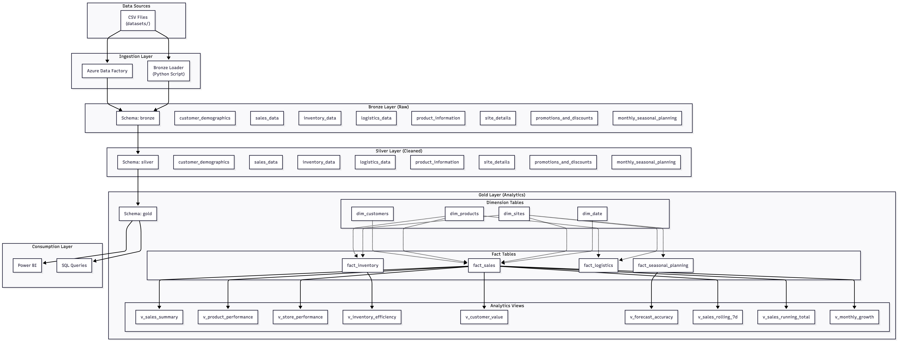
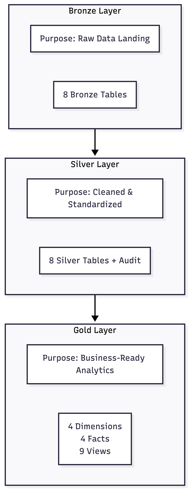
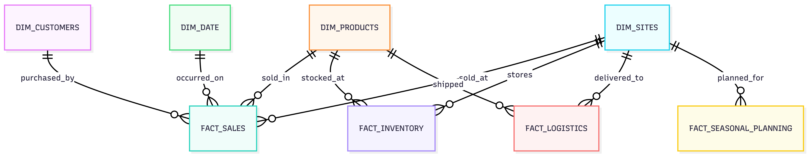
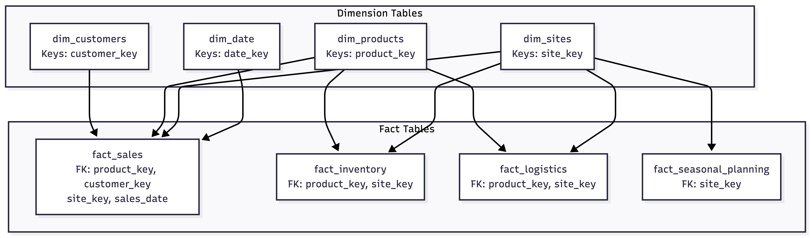
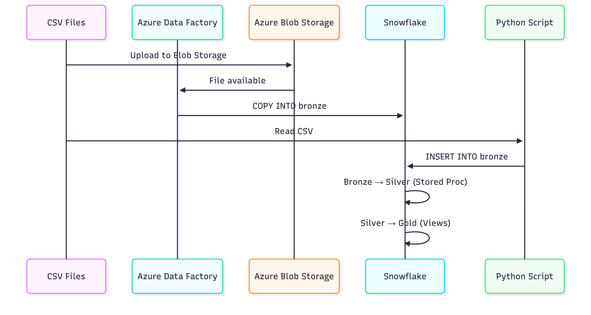
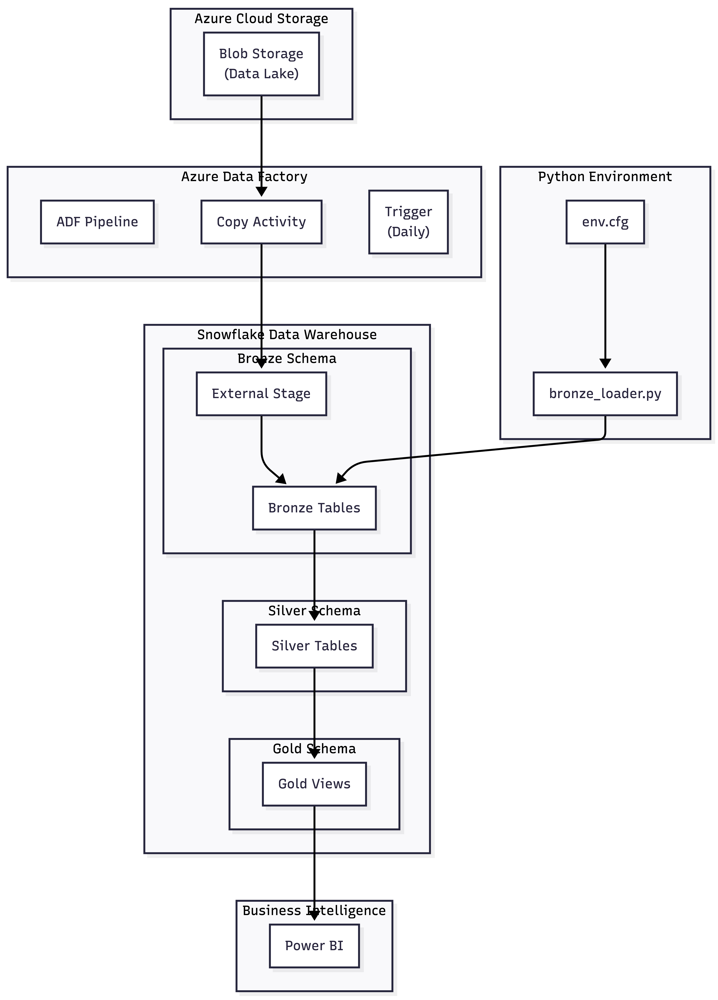
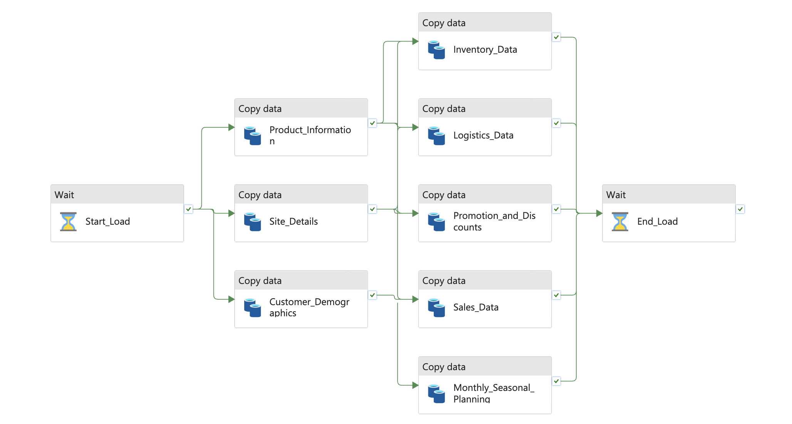

# Retail-Data-Analytics

A comprehensive data analytics project for retail business performance analysis. This repository implements a modern data warehouse architecture to process, transform, and analyze retail data, providing actionable insights into sales, inventory, customer behavior, logistics, and more.

## Table of Contents

- [Overview](#overview)
- [Architecture](#architecture)
- [Features](#features)
- [Technologies Used](#technologies-used)
- [Data Sources](#data-sources)
- [Documentation](#documentation)
- [Installation & Setup](#installation--setup)
- [Usage](#usage)
- [Testing](#testing)
- [Project Structure](#project-structure)
- [Contributing](#contributing)
- [License](#license)

## Overview

This project leverages data analytics techniques to uncover insights from retail operations data. By implementing a medallion architecture (Bronze → Silver → Gold), it transforms raw data into business-ready analytics, enabling data-driven decision-making for retail optimization.

Key objectives:
- Analyze sales performance and trends
- Optimize inventory management
- Understand customer behavior and segmentation
- Evaluate logistics efficiency
- Provide forecasting and planning insights

## Architecture

The project follows a **Medallion Architecture** implemented in Snowflake:

### Bronze Layer (Raw Data)
- Raw, ingested data from source systems
- Minimal transformations applied
- Tables: `customer_demographics`, `sales_data`, `inventory_data`, etc.

### Silver Layer (Cleaned & Standardized)
- Cleaned, validated, and standardized data
- Data quality checks and basic transformations
- Audit timestamps for data lineage tracking

### Gold Layer (Business-Ready Analytics)
- Dimensional models and fact tables
- Pre-computed KPIs and metrics
- Star schema for efficient querying
- Views for sales summaries, product performance, store analytics, etc.

#### Architecture Diagrams

The following diagrams provide visual representations of the system architecture:

| Diagram | Description |
|---------|-------------|
|  | High-level system architecture |
|  | Medallion architecture layers |
|  | ERD for gold layer tables |
|  | Table relationships and keys |
|  | Data flow sequence |
|  | Azure integration architecture |

## Features

- **Data Ingestion**: Automated loading of CSV datasets into Snowflake
- **Data Transformation**: ETL processes for data cleansing and standardization
- **Analytics Views**: Pre-built views for common retail KPIs
- **Role-Based Access Control**: Secure access management for different user types
- **Scalable Architecture**: Medallion design supporting large-scale retail data
- **Performance Monitoring**: Rolling averages, growth metrics, and forecast accuracy

## Technologies Used

- **Database**: Snowflake
- **Programming Language**: Python 3.7+
- **Libraries**: snowflake-connector-python, configparser
- **Data Formats**: CSV
- **Architecture**: Medallion (Bronze/Silver/Gold)
- **Version Control**: Git

## Data Sources

The project includes the following datasets (located in `datasets/`):

- `Customer_Demographics.csv`: Customer profile information
- `Inventory_Data.csv`: Stock levels and replenishment data
- `Logistics_Data.csv`: Shipment and delivery information
- `Monthly_Seasonal_Planning.csv`: Forecasting and planning data
- `Product_Information.csv`: Product catalog and pricing
- `Promotions_and_Discounts.csv`: Marketing campaign data
- `Sales_Data.csv`: Transaction-level sales data
- `Site_Details.csv`: Store location and operational data

## Documentation

This project includes documentation for both business and technical stakeholders:

| Document | Description |
|----------|-------------|
| [Business Glossary](docs/business_glossary.md) | Definitions of key terms, metrics, KPIs, and business rules used across the data warehouse |
| [Gold Layer Data Catalog](docs/data_catalog_gold_layer.md) | Complete catalog of dimension tables, fact tables, and analytics views in the Gold layer |

### Key Metrics and KPIs

The project tracks the following key metrics:

- **Sales Metrics**: Gross Revenue, Net Revenue, Units Sold, Average Selling Price
- **Customer Metrics**: Lifetime Value (LTV), Purchase Frequency, Average Spend per Purchase
- **Product Metrics**: Unit Cost, Unit Margin, Margin Percentage, Total Revenue by Product
- **Inventory Metrics**: Beginning/Ending Inventory, Replenishment, Sell-Through Rate
- **Logistics Metrics**: Shipment Quantity, Delivery Status, Delivered Flag
- **Forecasting Metrics**: Forecasted Sales, Actual Sales, Sales Variance, Forecast Accuracy

See [Business Glossary](docs/business_glossary.md) for complete definitions and formulas.

## Installation & Setup

### Prerequisites

- Snowflake account with appropriate permissions
- Python 3.7+
- Git

### Setup Steps

1. **Clone the repository:**
   
```bash
   git clone https://github.com/your-username/Retail-Data-Analytics.git
   cd Retail-Data-Analytics
   
```

2. **Install Python dependencies:**
   
```bash
   pip install snowflake-connector-python
   
```

3. **Configure Snowflake connection:**
   - Create `scripts/config/env.cfg` with your Snowflake credentials:
     
```ini
     [Parameters]
     user = YOUR_SNOWFLAKE_USER
     password = YOUR_SNOWFLAKE_PASSWORD
     account = YOUR_SNOWFLAKE_ACCOUNT
     warehouse = COMPUTE_WH
     database = RETAIL_DATA_ANALYTICS_DB
     schema = bronze

     [Dataset]
     path = datasets/
     file_format = CSV
     
```

4. **Initialize the database:**
   - Execute `scripts/db_init.sql` in Snowflake to create the database and schemas

5. **Set up roles and permissions:**
   - Execute `scripts/role_hierarchy.sql` to configure RBAC

6. **Create table structures:**
   - Execute DDL scripts in order:
     - `scripts/bronze/bronze_ddl.sql`
     - `scripts/silver/silver_ddl.sql`
     - `scripts/gold/gold_ddl.sql`


## Usage

## Data Loading

### Option 1: Run the Bronze Loader Script

Ingest data from the source CSV files by executing:

```bash
python scripts/bronze/bronze_loader.py
```

---

### Option 2: Load via DDL & Azure Data Factory

Alternatively, the Bronze layer can be created and loaded using the provided DDL and Azure Data Factory (ADF).

#### Step 1: Execute the DDL Script

Run the DDL defined in:

`scripts/bronze/adf_bronze_load.sql`

This script:

- Creates the required **external stage**
- Creates the necessary **stored procedure** to load data into the Bronze layer.

---

#### Step 2: Run the Azure Data Factory Pipeline

The process can also be orchestrated using Azure Data Factory (ADF).

The ADF pipeline loads data from the Git directory into the Azure Storage container.



---

#### Step 3: Execute the Bronze Load Procedure

Call the stored procedure defined in `adf_bronze_layer`:

```sql
CALL BRONZE.AZURE_LOAD_BRONZE();
```

This procedure loads the data into the Bronze layer from the configured external stage.

### Querying Analytics
Connect to Snowflake and query the Gold layer views:

```sql
-- Example: View sales summary
SELECT * FROM gold.v_sales_summary;

-- Example: Analyze product performance
SELECT * FROM gold.v_product_performance;

-- Example: Check forecast accuracy
SELECT * FROM gold.v_forecast_accuracy;
```

### Custom Analytics
Use the fact and dimension tables in the Gold layer for custom reporting:

```sql
SELECT
    dd.year,
    dp.category,
    SUM(fs.net_revenue) as total_revenue
FROM gold.fact_sales fs
JOIN gold.dim_date dd ON fs.sales_date = dd.date_key
JOIN gold.dim_products dp ON fs.product_key = dp.product_key
GROUP BY dd.year, dp.category;
```

## Testing

The project includes data quality validation through Jupyter notebooks in the `tests/` directory. These notebooks verify data integrity and completeness for each dataset:

| Test File | Description |
|-----------|-------------|
| `tests/customer_demographics_data_check.ipynb` | Validates customer demographic data |
| `tests/inventory_data_check.ipynb` | Validates inventory data |
| `tests/logistics_data_check.ipynb` | Validates logistics data |
| `tests/monthly_seasonal_planning_data_check.ipynb` | Validates seasonal planning data |
| `tests/product_information_data_check.ipynb` | Validates product information |
| `tests/promotions_and_discounts_data_check.ipynb` | Validates promotions data |
| `tests/sales_data_check.ipynb` | Validates sales transaction data |
| `tests/site_details_data_check.ipynb` | Validates store/site data |


## Project Structure

```
Retail-Data-Analytics/
├── datasets/                    # Raw data files (CSV)
│   ├── Customer_Demographics.csv
│   ├── Inventory_Data.csv
│   ├── Logistics_Data.csv
│   ├── Monthly_Seasonal_Planning.csv
│   ├── Product_Information.csv
│   ├── Promotions_and_Discounts.csv
│   ├── Sales_Data.csv
│   └── Site_Details.csv
├── docs/                        # Documentation
│   ├── ADF_Pipeline.png                  
│   ├── Architecture_Diagram.png
│   ├── business_glossary.md
│   ├── data_catalog_gold_layer.md
│   ├── Data_Layers.png
│   ├── entity_relationship_diagram.png
│   ├── Integration_architecture.png
│   ├── relationship_diagram.png
│   └── sequence_diagram.png
├── scripts/
│   ├── bronze/                  # Raw data layer scripts
│   │   ├── adf_bronze_load.sql
│   │   ├── bronze_ddl.sql       # Bronze table definitions
│   │   ├── bronze_loader.py     # Data ingestion script
│   │   └── bronze_loader_procedure.sql
│   ├── silver/                  # Cleaned data layer scripts
│   │   ├── silver_ddl.sql       # Silver table definitions
│   │   └── silver_loader_procedure.sql
│   ├── gold/                    # Analytics layer scripts
│   │   └── gold_ddl.sql         # Gold views and analytics
│   ├── modules/                 # Python modules
│   │   ├── Database.py          # Base database interface
│   │   └── SnowflakeDatabase.py # Snowflake implementation
│   ├── config/                  # Configuration files
│   │   └── env.cfg              # Environment Variables
│   ├── db_init.sql              # Database initialization
│   └── role_hierarchy.sql       # RBAC setup
├── tests/                       # Data quality test notebooks
│   ├── customer_demographics_data_check.ipynb
│   ├── inventory_data_check.ipynb
│   ├── logistics_data_check.ipynb
│   ├── monthly_seasonal_planning_data_check.ipynb
│   ├── product_information_data_check.ipynb
│   ├── promotions_and_discounts_data_check.ipynb
│   ├── sales_data_check.ipynb
│   └── site_details_data_check.ipynb
├── .gitignore                   # Git ignore rules
└── README.md                    # This file
```
